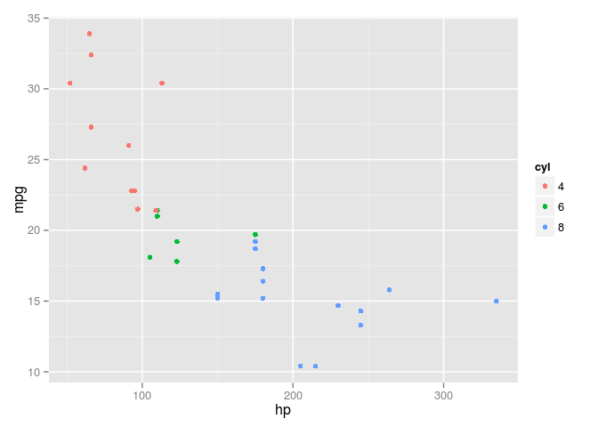
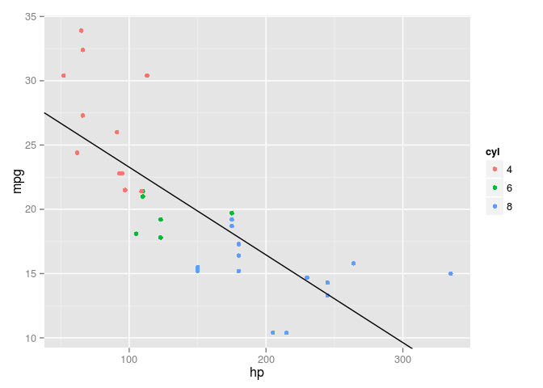
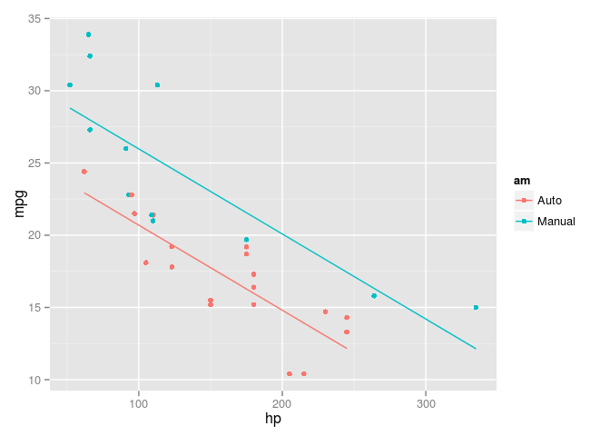
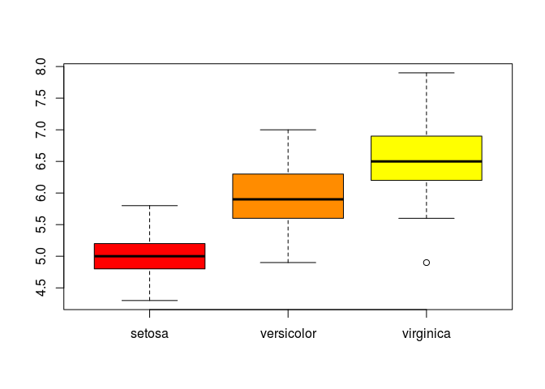
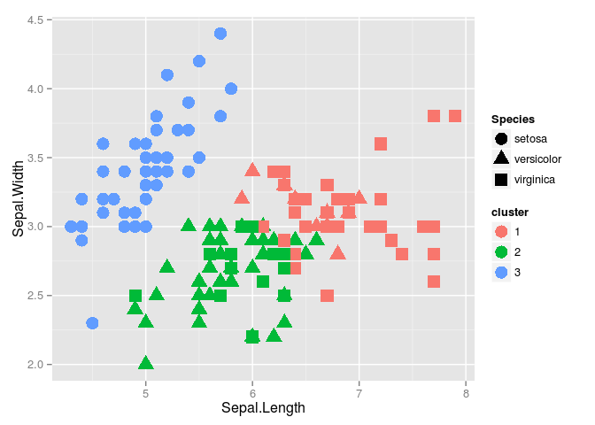
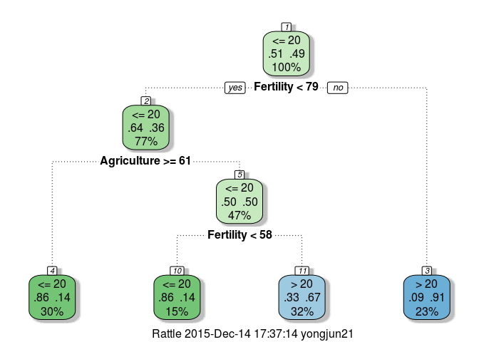
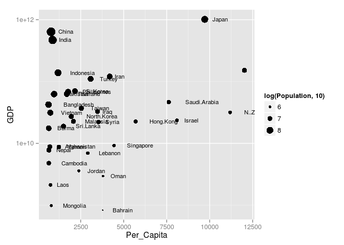

# Introduction to R
Yong Jun  
December 13, 2015  

## Why R?
- R & Python two of the most popular tools for data science work
- R is a language designed for the purpose of statistical programming and visualization
- It is a high level language
    - meaning it abstracts you away from many of the nitty gritty of details of doing statistical computation)
- It is open source
- Rich community of users that contribute libraries to do almost anything you need

## Difference with Python

#### Python

- General purpose programming language
- Statistical computation supported through packages like *NumPy*, *SciPy*, *pandas* etc
- Object-oriented

#### R

- Designed for statistical programming
- Has certain built-in design features that makes it suitable for this task
- Functional (through use of generic functions)

## First, a bit on structured data

- Structured data: SQL tables
- Semi-structured: JSON, XML
- Unstructured: Plain text, Image, Audio
- Terminology:
    - Tables
    - Records: Row
    - Fields: Columns
- Each record has a **fixed set of fields**
- Values within a field must be of the **same data type**
    - Numeric
    - String
    - Date
    - Categorical
    - Binary


```
##                      mpg cyl  disp  hp drat    wt  qsec vs am gear carb
## Mazda RX4           21.0   6 160.0 110 3.90 2.620 16.46  0  1    4    4
## Mazda RX4 Wag       21.0   6 160.0 110 3.90 2.875 17.02  0  1    4    4
## Datsun 710          22.8   4 108.0  93 3.85 2.320 18.61  1  1    4    1
## Hornet 4 Drive      21.4   6 258.0 110 3.08 3.215 19.44  1  0    3    1
## Hornet Sportabout   18.7   8 360.0 175 3.15 3.440 17.02  0  0    3    2
## Valiant             18.1   6 225.0 105 2.76 3.460 20.22  1  0    3    1
## Duster 360          14.3   8 360.0 245 3.21 3.570 15.84  0  0    3    4
## Merc 240D           24.4   4 146.7  62 3.69 3.190 20.00  1  0    4    2
## Merc 230            22.8   4 140.8  95 3.92 3.150 22.90  1  0    4    2
## Merc 280            19.2   6 167.6 123 3.92 3.440 18.30  1  0    4    4
## Merc 280C           17.8   6 167.6 123 3.92 3.440 18.90  1  0    4    4
## Merc 450SE          16.4   8 275.8 180 3.07 4.070 17.40  0  0    3    3
## Merc 450SL          17.3   8 275.8 180 3.07 3.730 17.60  0  0    3    3
## Merc 450SLC         15.2   8 275.8 180 3.07 3.780 18.00  0  0    3    3
## Cadillac Fleetwood  10.4   8 472.0 205 2.93 5.250 17.98  0  0    3    4
## Lincoln Continental 10.4   8 460.0 215 3.00 5.424 17.82  0  0    3    4
## Chrysler Imperial   14.7   8 440.0 230 3.23 5.345 17.42  0  0    3    4
## Fiat 128            32.4   4  78.7  66 4.08 2.200 19.47  1  1    4    1
## Honda Civic         30.4   4  75.7  52 4.93 1.615 18.52  1  1    4    2
## Toyota Corolla      33.9   4  71.1  65 4.22 1.835 19.90  1  1    4    1
## Toyota Corona       21.5   4 120.1  97 3.70 2.465 20.01  1  0    3    1
## Dodge Challenger    15.5   8 318.0 150 2.76 3.520 16.87  0  0    3    2
## AMC Javelin         15.2   8 304.0 150 3.15 3.435 17.30  0  0    3    2
## Camaro Z28          13.3   8 350.0 245 3.73 3.840 15.41  0  0    3    4
## Pontiac Firebird    19.2   8 400.0 175 3.08 3.845 17.05  0  0    3    2
## Fiat X1-9           27.3   4  79.0  66 4.08 1.935 18.90  1  1    4    1
## Porsche 914-2       26.0   4 120.3  91 4.43 2.140 16.70  0  1    5    2
## Lotus Europa        30.4   4  95.1 113 3.77 1.513 16.90  1  1    5    2
## Ford Pantera L      15.8   8 351.0 264 4.22 3.170 14.50  0  1    5    4
## Ferrari Dino        19.7   6 145.0 175 3.62 2.770 15.50  0  1    5    6
## Maserati Bora       15.0   8 301.0 335 3.54 3.570 14.60  0  1    5    8
## Volvo 142E          21.4   4 121.0 109 4.11 2.780 18.60  1  1    4    2
```

## What I'll be covering

There's so much to cover with regards to data science, machine learning or R but I don't have the time to go through all that. Plus there's also Python. So rather than taking a narrow focus of programming in R, I'll cover some of the special features in R that helps get you started in thinking about programming data science.

## Things about R
### Point 1: Everything is an Array

In R, the most basic data object is the 1 dimension array (vector). Try this:

Create an array:

```r
arr <- 1:10
arr
```

```
##  [1]  1  2  3  4  5  6  7  8  9 10
```

Array can be indexed or subsetted:

```r
arr[7]
arr[1:4]
arr[c(1, 3, 5)]
```

```
## [1] 7
## [1] 1 2 3 4
## [1] 1 3 5
```

Array operations:

```r
a <- 1:5
b <- 6:10
a + b
b - a
a * b
a / 2
a^2
a %% 2 == 0
```

```
## [1]  7  9 11 13 15
## [1] 5 5 5 5 5
## [1]  6 14 24 36 50
## [1] 0.5 1.0 1.5 2.0 2.5
## [1]  1  4  9 16 25
## [1] FALSE  TRUE FALSE  TRUE FALSE
```

Vector can only have one data type:

```r
arr <- c(1, 'a', TRUE)
arr
```

```
## [1] "1"    "a"    "TRUE"
```

```r
class(arr)
```

```
## [1] "character"
```

Try creating a "scalar":

```r
scalar <- 9
scalar
scalar[1]
length(scalar)
```

```
## [1] 9
## [1] 9
## [1] 1
```

Try adding two arrays of different length

```r
a <- 1:10
b <- 1:2
rbind(a, b, sum=a+b)
```

```
##     [,1] [,2] [,3] [,4] [,5] [,6] [,7] [,8] [,9] [,10]
## a      1    2    3    4    5    6    7    8    9    10
## b      1    2    1    2    1    2    1    2    1     2
## sum    2    4    4    6    6    8    8   10   10    12
```

Mapping a function

```r
f <- function (n) {
  n * 2
}
f(a)
```

```
##  [1]  2  4  6  8 10 12 14 16 18 20
```

Reduce functions

```r
sum(a)
mean(a)
min(a)
max(a)
cumsum(a)
```

```
## [1] 55
## [1] 5.5
## [1] 1
## [1] 10
##  [1]  1  3  6 10 15 21 28 36 45 55
```

This feature of R abstract us away from manually doing element-wise operations on array. How array addition in usually carried out in without array operation. Example Javascript:
```Javascript
var toReturn = []
for (var i = 0; i < a.length; i++) {
  toReturn.push(a[i] + b[i])
}
console.log(toReturn)
```

Not saying this cannot be done in other languages but additional libraries are needed (eg. Python -> Numpy, Javascript -> math.js). Matlab also builds on this feature but R brings it one step further by completely doing away with scalar data types. So everything is a vector.

Good read to understand the rational for vectorization in R:
[http://www.noamross.net/blog/2014/4/16/vectorization-in-r--why.html](http://www.noamross.net/blog/2014/4/16/vectorization-in-r--why.html)

### Point 2: R has data.frame

Vectors in R can be used to represent columns of data in a table. But a table is made up of a group of columns each by themselves must be of one data type but within themselves can have different data types. How do we address this?

Try using matrix:

```r
a <- 1:5
b <- c('a', 'b', 'c', 'd', 'e')
tb <- cbind(a, b)
tb
class(tb)
typeof(tb)
```

```
##      a   b  
## [1,] "1" "a"
## [2,] "2" "b"
## [3,] "3" "c"
## [4,] "4" "d"
## [5,] "5" "e"
## [1] "matrix"
## [1] "character"
```

Not a good idea because matrix like array can have only one data types so the first column is converted to chracter type to match second column. The data structure in R that can support different data types is a **list**:

```r
tb <- list(a=a, b=b)
tb
```

```
## $a
## [1] 1 2 3 4 5
## 
## $b
## [1] "a" "b" "c" "d" "e"
```

But tables have another constraint. Every column must be the same length. How do we make sure of this? In R, the answer comes in the form of **data.frame**:

```r
tb <- data.frame(a, b)
tb
x <- 1:2
print(try(tb <- data.frame(a, b, x)))
```

```
##   a b
## 1 1 a
## 2 2 b
## 3 3 c
## 4 4 d
## 5 5 e
## [1] "Error in data.frame(a, b, x) : \n  arguments imply differing number of rows: 5, 2\n"
## attr(,"class")
## [1] "try-error"
## attr(,"condition")
## <simpleError in data.frame(a, b, x): arguments imply differing number of rows: 5, 2>
```

So **data.frame** is a special type of **list** in R that enforces same length for every member. Of course it doesn't end there, **data.frame** has other features and behaviors useful for table-form data analysis.

Subsetting a **data.frame**:

```r
typeof(mtcars)
class(mtcars)
mtcars[mtcars$mpg > 25, ]
```

```
## [1] "list"
## [1] "data.frame"
##                 mpg cyl  disp  hp drat    wt  qsec vs am gear carb
## Fiat 128       32.4   4  78.7  66 4.08 2.200 19.47  1  1    4    1
## Honda Civic    30.4   4  75.7  52 4.93 1.615 18.52  1  1    4    2
## Toyota Corolla 33.9   4  71.1  65 4.22 1.835 19.90  1  1    4    1
## Fiat X1-9      27.3   4  79.0  66 4.08 1.935 18.90  1  1    4    1
## Porsche 914-2  26.0   4 120.3  91 4.43 2.140 16.70  0  1    5    2
## Lotus Europa   30.4   4  95.1 113 3.77 1.513 16.90  1  1    5    2
```

Selecting specific columns:

```r
mtcars[mtcars$mpg > 25, 1:3]
mtcars[mtcars$mpg > 25, -(1:3)]
mtcars[mtcars$mpg > 25, c('mpg', 'hp', 'wt')]
```

```
##                 mpg cyl  disp
## Fiat 128       32.4   4  78.7
## Honda Civic    30.4   4  75.7
## Toyota Corolla 33.9   4  71.1
## Fiat X1-9      27.3   4  79.0
## Porsche 914-2  26.0   4 120.3
## Lotus Europa   30.4   4  95.1
##                 hp drat    wt  qsec vs am gear carb
## Fiat 128        66 4.08 2.200 19.47  1  1    4    1
## Honda Civic     52 4.93 1.615 18.52  1  1    4    2
## Toyota Corolla  65 4.22 1.835 19.90  1  1    4    1
## Fiat X1-9       66 4.08 1.935 18.90  1  1    4    1
## Porsche 914-2   91 4.43 2.140 16.70  0  1    5    2
## Lotus Europa   113 3.77 1.513 16.90  1  1    5    2
##                 mpg  hp    wt
## Fiat 128       32.4  66 2.200
## Honda Civic    30.4  52 1.615
## Toyota Corolla 33.9  65 1.835
## Fiat X1-9      27.3  66 1.935
## Porsche 914-2  26.0  91 2.140
## Lotus Europa   30.4 113 1.513
```

**data.frame** can be passed into many functions in R to for further analysis. For example visualizing with **ggplot**

```r
library(ggplot2)
mtcars$cyl <- as.factor(mtcars$cyl)
gg <- ggplot(data=mtcars, aes(x=hp, y=mpg))
gg + geom_point(aes(color=cyl))
```

 

Python implements **data.frame** through the *pandas* library. Scientific plotting in R is done using **matplotlib**.

### Point 3: Machine learning is made easy with R
Say we want to model 'Miles Per Gallon' (mpg) as a function of 'Horse Power' (hp) by plotting a best fit straight line (i.e. linear regression):

```r
fit <- lm(mpg~hp, data=mtcars)
summary(fit)
```

```
## 
## Call:
## lm(formula = mpg ~ hp, data = mtcars)
## 
## Residuals:
##     Min      1Q  Median      3Q     Max 
## -5.7121 -2.1122 -0.8854  1.5819  8.2360 
## 
## Coefficients:
##             Estimate Std. Error t value Pr(>|t|)    
## (Intercept) 30.09886    1.63392  18.421  < 2e-16 ***
## hp          -0.06823    0.01012  -6.742 1.79e-07 ***
## ---
## Signif. codes:  0 '***' 0.001 '**' 0.01 '*' 0.05 '.' 0.1 ' ' 1
## 
## Residual standard error: 3.863 on 30 degrees of freedom
## Multiple R-squared:  0.6024,	Adjusted R-squared:  0.5892 
## F-statistic: 45.46 on 1 and 30 DF,  p-value: 1.788e-07
```

```r
gg + geom_point(aes(color=cyl)) +
  geom_abline(intercept=fit$coefficients[1], slope=fit$coefficients[2])
```

 

Let's predict mpg of cars with hp of 100, 200 & 300:

```r
test <- data.frame(hp=c(100, 200, 300))
predicted_mpg <- predict(fit, test)
cbind(test, predicted_mpg)
```

```
##    hp predicted_mpg
## 1 100     23.276033
## 2 200     16.453205
## 3 300      9.630377
```

How about adding transmission (auto/manual) as a predictor variable?

```r
mtcars$am <- as.factor(mtcars$am)
levels(mtcars$am) <- c('Auto', 'Manual')
fit <- lm(mpg~hp+am, data=mtcars)
summary(fit)
```

```
## 
## Call:
## lm(formula = mpg ~ hp + am, data = mtcars)
## 
## Residuals:
##     Min      1Q  Median      3Q     Max 
## -4.3843 -2.2642  0.1366  1.6968  5.8657 
## 
## Coefficients:
##              Estimate Std. Error t value Pr(>|t|)    
## (Intercept) 26.584914   1.425094  18.655  < 2e-16 ***
## hp          -0.058888   0.007857  -7.495 2.92e-08 ***
## amManual     5.277085   1.079541   4.888 3.46e-05 ***
## ---
## Signif. codes:  0 '***' 0.001 '**' 0.01 '*' 0.05 '.' 0.1 ' ' 1
## 
## Residual standard error: 2.909 on 29 degrees of freedom
## Multiple R-squared:  0.782,	Adjusted R-squared:  0.767 
## F-statistic: 52.02 on 2 and 29 DF,  p-value: 2.55e-10
```

```r
predicted_mpg <- predict(fit, mtcars)
ggplot(data=mtcars, aes(x=hp, y=mpg, color=am)) + geom_point()  +
  geom_line(aes(y=predicted_mpg))
```

 

Here, we demostrated a feature of R called **factor**. Which brings us to the next point

### Point 4: R has a special way to handle categorical data - **factor**

Factor converts an array of strings into integer representation

```r
data(iris)
head(iris)
summary(iris)
str(iris)
boxplot(Sepal.Length~Species, iris, col=c('red', 'dark orange', 'yellow'))
```

 

```
##   Sepal.Length Sepal.Width Petal.Length Petal.Width Species
## 1          5.1         3.5          1.4         0.2  setosa
## 2          4.9         3.0          1.4         0.2  setosa
## 3          4.7         3.2          1.3         0.2  setosa
## 4          4.6         3.1          1.5         0.2  setosa
## 5          5.0         3.6          1.4         0.2  setosa
## 6          5.4         3.9          1.7         0.4  setosa
##   Sepal.Length    Sepal.Width     Petal.Length    Petal.Width   
##  Min.   :4.300   Min.   :2.000   Min.   :1.000   Min.   :0.100  
##  1st Qu.:5.100   1st Qu.:2.800   1st Qu.:1.600   1st Qu.:0.300  
##  Median :5.800   Median :3.000   Median :4.350   Median :1.300  
##  Mean   :5.843   Mean   :3.057   Mean   :3.758   Mean   :1.199  
##  3rd Qu.:6.400   3rd Qu.:3.300   3rd Qu.:5.100   3rd Qu.:1.800  
##  Max.   :7.900   Max.   :4.400   Max.   :6.900   Max.   :2.500  
##        Species  
##  setosa    :50  
##  versicolor:50  
##  virginica :50  
##                 
##                 
##                 
## 'data.frame':	150 obs. of  5 variables:
##  $ Sepal.Length: num  5.1 4.9 4.7 4.6 5 5.4 4.6 5 4.4 4.9 ...
##  $ Sepal.Width : num  3.5 3 3.2 3.1 3.6 3.9 3.4 3.4 2.9 3.1 ...
##  $ Petal.Length: num  1.4 1.4 1.3 1.5 1.4 1.7 1.4 1.5 1.4 1.5 ...
##  $ Petal.Width : num  0.2 0.2 0.2 0.2 0.2 0.4 0.3 0.2 0.2 0.1 ...
##  $ Species     : Factor w/ 3 levels "setosa","versicolor",..: 1 1 1 1 1 1 1 1 1 1 ...
```

So you can see factor is an efficient way of storing categorical data. Factor is also useful for ordering and comparing nominal data (eg. First, Second, Third):

```r
orderedMonth <- c('Jan', 'Feb', 'Mar', 'Apr', 'May', 'Jun')
unorderedMonth <- c('May', 'Mar', 'Jan', 'Apr', 'Feb', 'Jun')
mon <- factor(unorderedMonth, levels=orderedMonth, ordered=TRUE)
mon
mon[1] > mon[2]
mon[5] > mon[6]
```

```
## [1] May Mar Jan Apr Feb Jun
## Levels: Jan < Feb < Mar < Apr < May < Jun
## [1] TRUE
## [1] FALSE
```

Factor is also supported in Python through **pandas**

## What are some interesting things R can do?

### K-means clustering

```r
scaled_data <- scale(as.matrix(iris[,-5]))
km <- kmeans(scaled_data, 3)
iris$cluster <- as.factor(km$cluster)
ggplot(data=iris, aes(x=Sepal.Length, y=Sepal.Width, color=cluster, shape=Species)) +
  geom_point(size=5)
```

 

## Word Cloud

```r
library(wordcloud)
```

```
## Loading required package: RColorBrewer
```

```r
library(zipfR)
data("Brown.tfl")
Brown_subset <- Brown.tfl[order(Brown.tfl$f, decreasing=TRUE),][1:150,]
wordcloud(Brown_subset$type,
          Brown_subset$f,
          scale=c(7,1),
          color=brewer.pal(8,'Dark2'),
          random.order=FALSE,
          random.color=TRUE,
          rot.per=.3)
```

 

## Decision Tree

```r
library(rpart)
library(rattle)
```

```
## Rattle: A free graphical interface for data mining with R.
## Version 4.0.5 Copyright (c) 2006-2015 Togaware Pty Ltd.
## Type 'rattle()' to shake, rattle, and roll your data.
```

```r
data("swiss")
head(swiss)
```

```
##              Fertility Agriculture Examination Education Catholic
## Courtelary        80.2        17.0          15        12     9.96
## Delemont          83.1        45.1           6         9    84.84
## Franches-Mnt      92.5        39.7           5         5    93.40
## Moutier           85.8        36.5          12         7    33.77
## Neuveville        76.9        43.5          17        15     5.16
## Porrentruy        76.1        35.3           9         7    90.57
##              Infant.Mortality
## Courtelary               22.2
## Delemont                 22.2
## Franches-Mnt             20.2
## Moutier                  20.3
## Neuveville               20.6
## Porrentruy               26.6
```

```r
summary(swiss)
```

```
##    Fertility      Agriculture     Examination      Education    
##  Min.   :35.00   Min.   : 1.20   Min.   : 3.00   Min.   : 1.00  
##  1st Qu.:64.70   1st Qu.:35.90   1st Qu.:12.00   1st Qu.: 6.00  
##  Median :70.40   Median :54.10   Median :16.00   Median : 8.00  
##  Mean   :70.14   Mean   :50.66   Mean   :16.49   Mean   :10.98  
##  3rd Qu.:78.45   3rd Qu.:67.65   3rd Qu.:22.00   3rd Qu.:12.00  
##  Max.   :92.50   Max.   :89.70   Max.   :37.00   Max.   :53.00  
##     Catholic       Infant.Mortality
##  Min.   :  2.150   Min.   :10.80   
##  1st Qu.:  5.195   1st Qu.:18.15   
##  Median : 15.140   Median :20.00   
##  Mean   : 41.144   Mean   :19.94   
##  3rd Qu.: 93.125   3rd Qu.:21.70   
##  Max.   :100.000   Max.   :26.60
```

```r
swiss$Infant.Mortality <- ifelse(swiss$Infant.Mortality > 20, '> 20', '<= 20')
swiss$Infant.Mortality <- as.factor(swiss$Infant.Mortality)
fit <- rpart(Infant.Mortality~., data=swiss)
fancyRpartPlot(fit)
```

 

```r
predict(fit, swiss, type='class')
```

```
##   Courtelary     Delemont Franches-Mnt      Moutier   Neuveville 
##         > 20         > 20         > 20         > 20         > 20 
##   Porrentruy        Broye        Glane      Gruyere       Sarine 
##         > 20         > 20         > 20         > 20         > 20 
##      Veveyse        Aigle      Aubonne     Avenches     Cossonay 
##         > 20        <= 20        <= 20         > 20        <= 20 
##    Echallens     Grandson     Lausanne    La Vallee       Lavaux 
##        <= 20         > 20        <= 20        <= 20        <= 20 
##       Morges       Moudon        Nyone         Orbe         Oron 
##         > 20         > 20        <= 20        <= 20        <= 20 
##      Payerne Paysd'enhaut        Rolle        Vevey      Yverdon 
##         > 20        <= 20        <= 20         > 20         > 20 
##      Conthey    Entremont       Herens     Martigwy      Monthey 
##        <= 20        <= 20        <= 20        <= 20         > 20 
##   St Maurice       Sierre         Sion       Boudry La Chauxdfnd 
##        <= 20         > 20        <= 20         > 20         > 20 
##     Le Locle    Neuchatel   Val de Ruz ValdeTravers V. De Geneve 
##         > 20         > 20         > 20         > 20        <= 20 
##  Rive Droite  Rive Gauche 
##        <= 20        <= 20 
## Levels: <= 20 > 20
```

## Interactive Chart

```r
library(reshape2)
GDP <- read.csv('GDP.csv')
Population <- read.csv('Population.csv')

GDP <- melt(GDP, id.vars='Year', variable.name='Country', value.name='GDP')
Population <- melt(Population, id.vars='Year', variable.name='Country', value.name='Population')

combined <- data.frame(Population, GDP)
combined$GDP <- combined$GDP * 1000000
combined$Population <- combined$Population * 1000
combined$Per_Capita <- combined$GDP / combined$Population
combined <- combined[!(combined$Country %in% c('Kuwait','UAE','Qatar')),]

gg <- function(year) {
  qplot(x=Per_Capita, y=GDP, size=log(Population,10), label=Country, data=combined[combined$Year==year,], log='y') + geom_text(hjust=-.5, size=3)
}
gg(1970)
```

 


```r
library(manipulate)
manipulate(gg(year), year=slider(min=1970, max=2008, step=2))
```

## Shiny App
